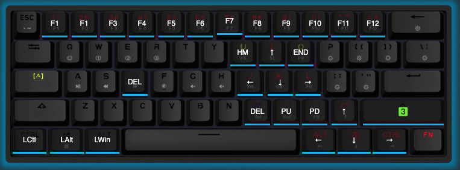

# gk61-keyboard-config
My GK61 keyboard config

To upload a color scheme config use  http://www.jikedingzhi.com/downloadlist?driverID=41latest. It runs on Windows, Mac, and Linux.  
Or use an alternative software from https://github.com/pixeltris/GK6X

Open the program GK6+, selrct LE Files tab, navigate to right bottom corner of a window, clock Arrow Up button to Import the scheme from a file, select file and open.  
To apply the scheme switch to Configurations tab and search for r3code in the LE Files panel, select a scheme, click View, Apply, Save. Color scheme saved into your keyboard.

## Layer 1

Temporal switch to Layer 2 by CapsLock.

# Layer 2

